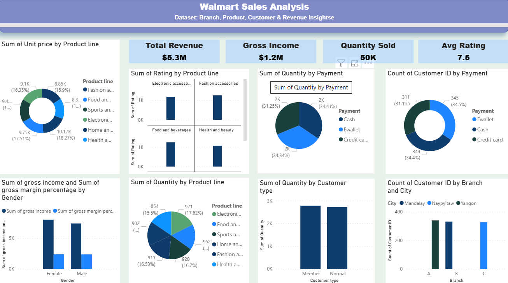

# 📊 Walmart Sales Data Analysis  

  

## 📌 Project Overview  
This project analyzes **Walmart sales data** using Power BI to generate actionable insights across revenue, products, customers, and payment methods. The goal is to understand **branch performance, customer behavior, and product line trends** for better decision-making.  

## 📂 Dataset  
- **Source**: Walmart Sales Dataset  
- **Attributes**:  
  - Invoice ID  
  - Branch & City  
  - Customer Type & Gender  
  - Product Line  
  - Unit Price & Quantity  
  - Tax & Total Revenue  
  - Payment Method  
  - Rating  

## 📊 Dashboard Insights  

### 🔹 Key Metrics (KPIs)  
- **Total Revenue**: **$5.3M**  
- **Gross Income**: **$1.2M**  
- **Quantity Sold**: **50K**  
- **Average Rating**: **7.5**  

### 🔹 Visual Analysis  
1. **Unit Price by Product Line**  
   - Highest average unit price: *Home and Lifestyle, Health & Beauty*.  
   - Lowest: *Sports & Travel*.  

2. **Revenue & Ratings by Product Line**  
   - *Food and Beverages* shows consistent high ratings.  
   - *Fashion Accessories* contributes significantly to revenue.  

3. **Sales by Payment Method**  
   - Customers are almost evenly split between **Cash (34.4%)**, **E-wallet (34.5%)**, and **Credit Card (31.1%)**.  

4. **Gender Insights**  
   - Female customers generate slightly more **gross income** compared to males.  

5. **Customer Type Analysis**  
   - Both **Members** and **Normal Customers** purchase in almost equal quantities.  

6. **Branch & City Distribution**  
   - Balanced distribution across **Mandalay, Naypyitaw, and Yangon**.  
   - Branches A & B lead in customer counts.  

## ⚙️ Tools & Technologies  
- **Power BI**: Dashboard creation & visualization  
- **Python (optional)**: Data preprocessing  
- **Excel/CSV**: Dataset storage  

## 🚀 How to Use  
1. Clone this repository:  
   ```bash
   git clone https://github.com/AnanyaSinghBabu/Walmart-Sales-Data-Analysis.git
